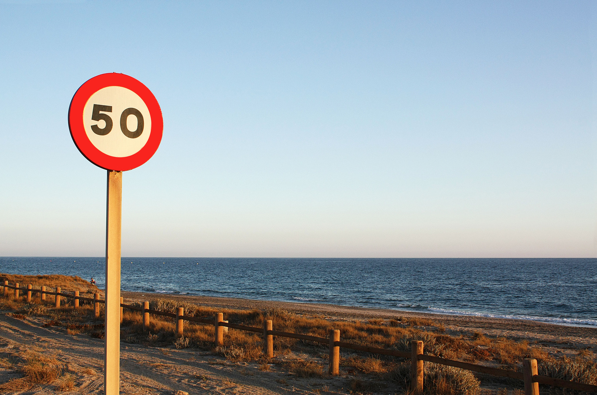

# **Traffic Sign Recognition** 

Overview
---
In this project, I will use deep neural networks and convolutional neural networks to classify traffic signs. I will train and validate a model so it can classify traffic sign images using the [German Traffic Sign Dataset](http://benchmark.ini.rub.de/?section=gtsrb&subsection=dataset). 

The goals / steps of this project are the following:
* Load the data set (see below for links to the project data set)
* Explore, summarize and visualize the data set
* Design, train and test a model architecture
* Use the model to make predictions on new images
* Analyze the softmax probabilities of the new images
* Summarize the results with a written report

[//]: # (Image References)

[image1]: ./images/data_visualization.jpg "Visualization"
[image2]: ./images/test_images.jpg "Test"
[image3]: ./images/result_images.jpg "Result"
[image4]: ./images/top5_1.jpg "Result5_1"
[image5]: ./images/top5_2.jpg "Result5_2"
[image6]: ./images/top5_3.jpg "Result5_3"
[image7]: ./images/top5_4.jpg "Result5_4"

### Dependencies

This project requires **Python 3.5** and the following Python libraries installed:

- [Jupyter](http://jupyter.org/)
- [NumPy](http://www.numpy.org/)
- [TensorFlow](http://tensorflow.org)
- [Matplotlib](http://matplotlib.org/)
- [Pandas](http://pandas.pydata.org/) 

## Dataset

1. [Download the dataset](https://d17h27t6h515a5.cloudfront.net/topher/2016/November/581faac4_traffic-signs-data/traffic-signs-data.zip). This is a pickled dataset in which we've already resized the images to 32x32.

### Data Set Summary & Exploration

#### 1. A basic summary of the data set.

I used the numpy library to calculate summary statistics of the traffic
signs data set:

* The size of training set is &nbsp; 34799 &nbsp; images
* The size of the validation set is &nbsp; 4410 &nbsp; images 
* The size of test set is &nbsp; 12630 &nbsp; images
* The shape of a traffic sign image is &nbsp; (32, 32, 3)
* The number of unique classes/labels in the data set is &nbsp; 43

#### 2. An exploratory visualization of the dataset.

![alt text][image1]

### Design and Test a Model Architecture

#### 1.Pre-processing 
I normalized the image data and also divided by the standard deviation of each feature (pixel) value as well. Subtracting the mean centers the input to 0, and dividing by the standard deviation makes any scaled feature value the number of standard deviations away from the mean,so that all the inputs are at a comparable range.

#### 2. My final model architecture : 

My final model consisted of the following layers:

| Layer         		|     Description	        					| 
|:---------------------:|:---------------------------------------------:| 
| Input         		| 32x32x3 RGB image   							| 
| Convolution 5x5     	| 1x1 stride, outputs 28x28x6               	|
| RELU					|   Activation Function							|
| Max pooling	      	| 2x2 stride,  outputs 14x14x6 			       	|
| Convolution 5x5     	| 1x1 stride, outputs 10x10x16               	|
| RELU					|   Activation Function							|
| Max pooling	      	| 2x2 stride,  outputs 5x5x16 			       	|
|	Flatten				|		output 400								|
|	Fully connected		|		output 120								|
|	RELU     			|		Activation Function			  	    	|
| Dropout	        	|       50%       		             			|
| Fully connected		|       output 84       		     			|
|	RELU     			|		Activation Function			  	    	|
| Dropout		        |       50%      	        	     			|
|	Fully connected		|				output 43						|

#### 3. Training the model :

To train the model, I used an Adam Optimizer , batch size of 128 , number of epochs is 45 and a learning rate of 0.0008 

#### 4. Training Results :

My final model results were:
* training set accuracy of &nbsp; 0.999
* validation set accuracy of &nbsp;  0.965
* test set accuracy of &nbsp;  0.951

 

### Test a Model on New Images

#### 1. An eight German traffic signs found on the web :

![alt text][image2] 

Here are the results of the prediction:
![alt text][image3] 

| Image			        |     Prediction	        					| 
|:---------------------:|:---------------------------------------------:| 
| Turn left ahead   	| Turn left ahead 								| 
| Speed limit (70km/h) 	| Speed limit (70km/h)     	                    |
| Priority road			| Priority road					        	    |
| Slippery road	     	| Slippery road	 					 			|
| Speed limit (50km/h)	| Speed limit (60km/h)   						|
| General caution		| General caution      					        |
| Double curve			| children crossing      				        |
| Bumpy road			| no entry     							        |

#### 3. The top 5 softmax probabilities for each image :

![alt text][image4] 
![alt text][image5] 
![alt text][image6] 
![alt text][image7] 

